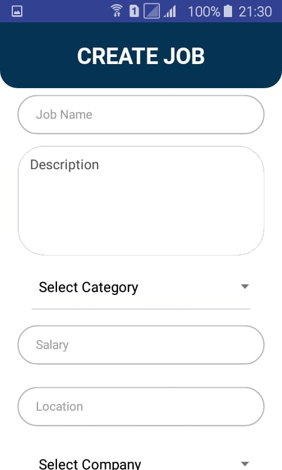

# Geek Jobs : Job Posting app mobile

## Table Of Contents

- [Intro](#Intro)
- [Requirments](#Requirments)
- [Related Projects](#Related-Projects)
- [Dependencies](#Dependencies)
  - [Clone Repo](#Clone-Repo)
  - [Install Depedencies](#Install-Depedencies)
  - [Setup Environment](#Setup-Environment)
    <!-- - [Run server development](#Run-server-development) -->
  - [Build For Production](#Build-For-Production)
- [Dependencies](#Dependencies)
- [Interface](#interface)
- [License and Support](#License-and-Support)

---

---

### Features

- [x] Simple UI Design
- [x] Manage Job (CRUD)
- [x] List and Detail Job
- [x] Search Job what you want based on location or keyword
- [x] Manage Company (CRUD)
- [x] Authentication with JWT
- [x] Async Storage

---

### Requirments

- [Nodejs](https://nodejs.org/en/) v10 LTS version
- [Android SDK](https://developer.android.com/studio#downloads)
- [Npm](https://www.npmjs.com/get-npm) package / [Yarn](https://yarnpkg.com/lang/en/docs/install/#mac-stable) package

---

### Related Projects

This project is related to several platforms

- Backend with Node.js [https://github.com/FakhrurR/Job-Posting-App](https://github.com/FakhrurR/Job-Posting-App)
- Web App (Reactjs) [https://github.com/FakhrurR/react-job-posting](https://github.com/FakhrurR/react-job-posting)

---### Installation

##### 1. Clone Repo

clone the repository

```sh
$ git clone https://github.com/FakhrurR/geek-jobs
$ cd geek-jobs
```

##### Install Depedencies

Install requirement depedencies

```sh
$ npm install
```

##### Setup Environment

Before start server development or build for production, you should create new .env file. you can found the backend server here.. [https://github.com/FakhrurR/Job-Posting-App](https://github.com/FakhrurR/Job-Posting-App)

##### Run on android device

```sh
$ react-native run android
```

##### Run on ios device

```sh
$ react-native run ios
``` 

##### Build For Production

build for production ready, and host ready

```sh
$ cd android && ./gradlew --assembleRelease
```

---

### Dependencies

List of depedencies using in this project

| Plugin                                                                             | Description                     |
| ---------------------------------------------------------------------------------- | ------------------------------- |
| [React Native](https://facebook.github.io/react-native/)                           | Mobile Apps Framework           |
| [Axios](https://github.com/axios/axios)                                            | HTTP client for request API     |
| [Redux](https://redux.js.org)                                                      | Global State Management         |
| [Redux Promise Middleware](https://www.npmjs.com/package/redux-promise-middleware) | Promise handler for react redux |

### interface

 &nbsp;&nbsp;&nbsp;
 &nbsp;&nbsp;&nbsp;
 &nbsp;&nbsp;&nbsp;
 &nbsp;&nbsp;&nbsp;
 &nbsp;&nbsp;&nbsp;
 &nbsp;&nbsp;&nbsp;
 &nbsp;&nbsp;&nbsp;
 


## License and Support

For Bug report, please contact me
[FakhrurR](https://github.com/FakhrurR 'FakhrurR')

MIT

Copyright © 2019 by Fakhrur Rijal

